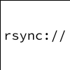
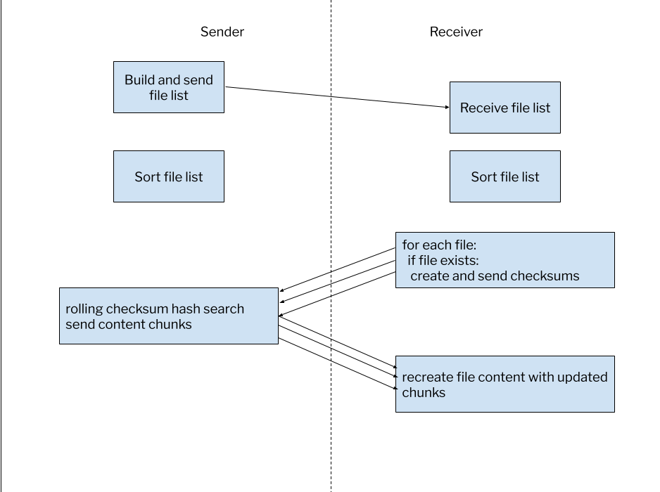

[Rsync](https://rsync.samba.org/) is an open source utility that provides
fast incremental file transfer. Rsync is efficient because you can have it
transfer only the files which do not exist, or have changed, rather than
re-transfering every file. It works locally as well as remotely.

In this track, you will be working on a local workstation, and have access
to a remote fileserver. In this challenge we're going to copy our source data
from the fileserver to our local directory. In later challenges we'll explore
various options of `rsync`, before finally uploading the data back up to the
fileserver.

If at any point you are curious, you can check out the [rsync man page](tab-1)
tab to see the full list of `rsync` options.



If you are curious on how things work behind the scenes, check out
[How Rsync Works: A Practical Overview](https://rsync.samba.org/how-rsync-works.html).

**You don't need to know how rsync works to use it, however.**

We're going to run this command. Don't worry about what the options mean for
now, let's just get the files locally so we can work with them.

```bash,run
rsync -av --progress --stats fileserver:[[ Instruqt-Var key="FILESERVER_SRC_DIR" hostname="workstation" ]] [[ Instruqt-Var key="WORKSTATION_DST_DIR" hostname="workstation" ]]
```

You can either click on the "copy" link in the upper right corner of the
command window above, or you can click on "run". Run it in the [Workstation](tab-0)
tab.

When you have finished, click on the **Check** button below to verify
you have completed this challenge successfully.
